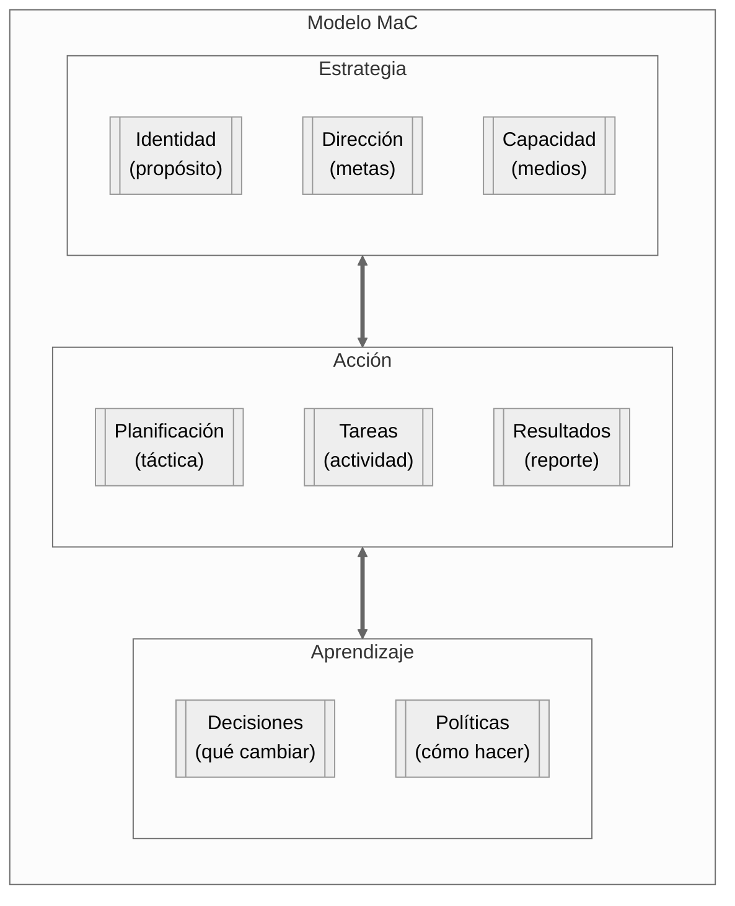

# MaC para gente impaciente

## TL;DR

**Management as Code (MaC)** es un sistema de gestión basado en documentos `.md`, procesos entre esos documentos, y cadencias de revisión. Funciona para una persona sola, un equipo de 6 o una organización de 80. Empieza mínimo (un log semanal) y crece solo cuando la realidad lo exige.

**En una frase:** Archivos de texto + procesos claros + ritmo semanal = gestión que escala sin burocracia.

---

## El modelo

**Tres pilares, ocho capas.** Cada capa responde una pregunta:

| Pilar           | Capa          | Pregunta                                      |
| --------------- | ------------- | --------------------------------------------- |
| **Estrategia**  | Identidad     | ¿Por qué existimos y qué nos diferencia?      |
|                 | Dirección     | ¿Hacia dónde vamos?                           |
|                 | Capacidad     | ¿Con qué contamos realmente?                  |
| **Acción**      | Planificación | ¿Qué hacer a continuación?                    |
|                 | Tareas        | ¿Quién hace qué y cuándo?                     |
|                 | Resultados    | ¿Qué fue diferente a lo esperado?             |
| **Aprendizaje** | Decisiones    | ¿Qué cambiamos a partir de lo que aprendimos? |
|                 | Políticas     | ¿Esto ya es una regla o seguimos caso a caso? |

---

## Los 8 procesos

Los documentos no se conectan solos. Estos procesos son las transiciones entre capas:

| # | Proceso | Conecta | Pregunta clave |
|---|---|---|---|
| 1 | **Enmarcar** | Identidad → Dirección | ¿Este objetivo es coherente con lo que somos? |
| 2 | **Dimensionar** | Dirección → Capacidad | ¿Tenemos los medios? |
| 3 | **Priorizar** | Dirección + Capacidad → Plan | ¿Qué entra y qué queda fuera? |
| 4 | **Descomponer** | Plan → Tareas | ¿Quién hace qué? |
| 5 | **Registrar** | Tareas → Resultados | ¿Qué fue diferente a lo esperado? |
| 6 | **Interpretar** | Resultados → Decisión | ¿Qué cambiamos? |
| 7 | **Consolidar** | Decisiones → Política | ¿Esto ya es una regla? |
| 8 | **Actualizar** | Aprendizaje → Estrategia | ¿Cambió quiénes somos o hacia dónde vamos? |

Ver [Procesos entre capas](procesos-mac.md) para el detalle completo con ejemplos por escala.

---

## Empieza aquí — 3 pasos

**Paso 1 — Registrar (semana 1).**
Crea un archivo `log-semanal.md`. Cada viernes, anota qué hiciste y qué fue distinto a lo esperado. Nada más. 10 minutos.

**Paso 2 — Priorizar (semana 2).**
Crea un archivo `plan-semanal.md`. Cada lunes, escribe qué entra esta semana y qué no. Si no cabe, no cabe. 10 minutos.

**Paso 3 — Decidir (cuando pase algo inesperado).**
Cuando un resultado te sorprenda — positivo o negativo — anótalo en `decisiones.md` con la fecha, qué decidiste y por qué. 5 minutos.

Eso es MaC mínimo. Todo lo demás aparece cuando lo necesitas.

---

## ¿Y después?

- → **[Implementación de MaC](implementacion-mac.md)** — Cómo crecer el sistema según tu escala y situación.
- → **[Método MaC](metodo-mac.md)** — La referencia completa: modelo, procesos, cadencias, preguntas por capa.
- → **Historias** — Tres ejemplos simulados de implementación por escala: [Javiera](historias/javiera%20-%20relato%20de%20un%20independiente.md) (1 persona), [Nexo](historias/nexo%20-%20relato%20de%202%20a%2010%20personas.md) (6 personas), [NovaTech](historias/novatech%20-%20relato%20empresa%20mediana.md) (80 personas).
