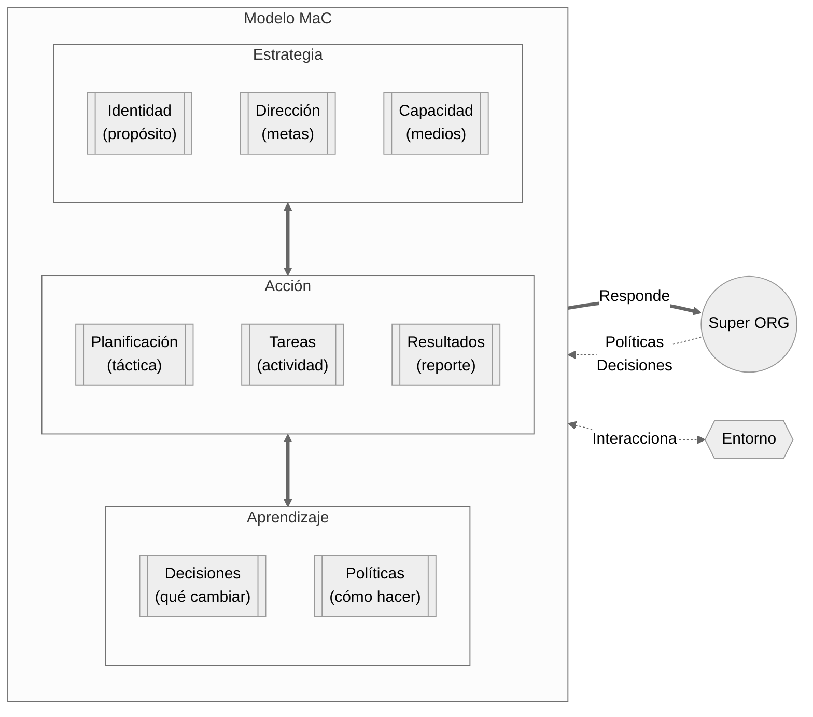
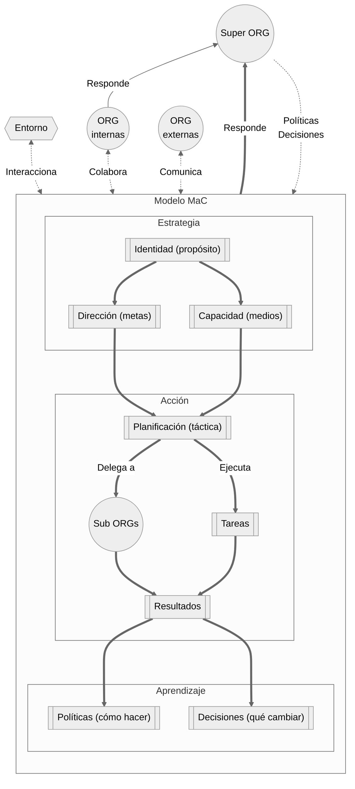

# Método MaC — Management as Code

## Qué es MaC

MaC (Management as Code) es un sistema de gestión basado en documentos estructurados (archivos `.md`), procesos entre esos documentos, y cadencias de revisión. Convierte la gestión en algo versionable, consultable y — cuando se está listo — automatizable.

**Premisas:**

- Una persona es una organización. Un equipo es una organización. Una empresa es una organización. MaC funciona igual en las tres.
- La organización es la suma de sus decisiones, no de sus intenciones.
- El aprendizaje viene de las sorpresas: la diferencia entre lo planificado y lo que realmente pasó.
- La comunicación es incompleta por naturaleza. Lo que no está escrito, para el sistema no existe.
- La gestión no se instala, se cultiva. El sistema empieza mínimo y crece solo cuando la realidad lo exige.

---

## Principios de diseño

### De menos a más
Empiezas con un log semanal. Agregas capas solo cuando la capa anterior genera una necesidad visible. Si armaste todo el sistema antes de necesitarlo, vas a abandonarlo.

### Coherencia vertical
La conexión entre lo que se hace abajo (tareas diarias) y por qué se hace arriba (estrategia). Si un ticket de JIRA no puede trazarse a un objetivo, algo falta. Si un objetivo no puede trazarse a la identidad, algo sobra.

### Aprendizaje por sorpresas
El ciclo **Acción → Aprendizaje** gira alrededor de una pregunta: *¿Qué fue diferente a lo esperado?* Las sorpresas — positivas y negativas — son el insumo del aprendizaje. Sin registro de sorpresas, no hay mejora, solo repetición.

### Los documentos son la interfaz
Los archivos `.md` son legibles por humanos, versionables con Git, y procesables por agentes IA. No se necesita una herramienta especial. Un editor de texto basta; Obsidian lo hace más cómodo.

---

## Modelo de capas



### Pilar 1 — Estrategia

La estrategia es lo que permanece estable mientras el ciclo Acción → Aprendizaje gira. Solo cambia cuando el aprendizaje produce una decisión que la modifica explícitamente.

**Identidad** — *¿Por qué existimos y qué nos diferencia?*
Lo que seguiría siendo verdadero aunque todo lo demás cambiara. Incluye propósito, principios no negociables, para quién existe la organización y qué NO es. Es la herramienta para decir que no.

**Dirección** — *¿Hacia dónde vamos y cómo sabremos que llegamos?*
Objetivos con horizonte de tiempo, responsable, y criterio de logro. Los objetivos deben poder justificarse desde la Identidad (si no pueden, el proceso Enmarcar los filtra).

**Capacidad** — *¿Con qué contamos realmente?*
Inventario de medios, restricciones y dependencias. No lo que querríamos tener, sino lo que hay. Incluye: personas y su disponibilidad real, dinero, herramientas, dependencias externas con sus plazos, y puntos únicos de falla.

### Pilar 2 — Acción

La acción es donde la estrategia se convierte en realidad. Se descompone en tres momentos: planificar, ejecutar, registrar.

**Planificación** — *¿Qué hacer a continuación?*
Dado lo que sabemos de Dirección, Capacidad y aprendizajes recientes: qué entra en el próximo ciclo y qué queda explícitamente fuera. Priorizar es elegir; lo que no cabe, no cabe.

**Tareas** — *¿Quién hace qué y cuándo?*
Descomposición de la planificación en actividades concretas con responsable, fecha y dependencias. La tarea que nadie tiene asignada no se hace. La dependencia que nadie conoce se convierte en bloqueo.

**Resultados** — *¿Qué fue diferente a lo esperado?*
Registro de lo que ocurrió versus lo planificado. Lo que importa no es solo qué se completó, sino dónde están las sorpresas. Esas sorpresas son el puente entre la Acción y el Aprendizaje.

### Pilar 3 — Aprendizaje

El aprendizaje cierra el ciclo. Toma los resultados (especialmente las sorpresas) y produce dos tipos de output:

**Decisiones** — *¿Qué cambiamos a partir de lo que aprendimos?*
Output puntual. Se registran con: fecha, qué se decidió, por qué, quién decidió (en equipo), y bajo qué condición debería revisarse.

**Políticas** — *¿Esto ya es una regla o seguimos caso a caso?*
Output estructural. Cuando una decisión similar se toma dos o más veces, se consolida en una política: cómo hacemos las cosas aquí. Cada política tiene origen trazable en las decisiones que la generaron.

---

## Documentos

La forma exacta de los documentos depende de la complejidad de cada organización. Lo que no cambia es la pregunta que cada uno responde.

| Pilar | Capa | Documento típico | Contenido mínimo |
|---|---|---|---|
| **Estrategia** | Identidad | `identidad.md` | Por qué existimos, qué nos diferencia, qué NO somos |
| | Dirección | `direccion.md` | 3-5 objetivos con horizonte y responsable |
| | Capacidad | `capacidad.md` | Recursos reales, restricciones, dependencias, puntos de falla |
| **Acción** | Planificación | `plan-semanal.md` | Qué entra, qué no, dependencias |
| | Tareas | `tareas.md` / JIRA / kanban | Quién, qué, cuándo, estado |
| | Resultados | `log-semanal.md` | Qué se hizo, qué fue diferente, sorpresas |
| **Aprendizaje** | Decisiones | `decisiones.md` | Fecha, qué, por qué, condición de revisión |
| | Políticas | `politica-X.md` | Regla + origen (qué decisiones la generaron) |

**Ejemplos adicionales de archivos por capa:**

| Pilar | Capa | Otros archivos posibles |
|---|---|---|
| **Estrategia** | Identidad | `README.md`, `briefing.md`, `mision.md` |
| | Dirección | `roadmap.md`, `objetivos-anuales.md` |
| | Capacidad | `equipo.md`, `presupuesto.md`, `stack.md` |
| **Acción** | Planificación | `plan-mensual.md`, `sesion-YYYY-MM-DD.md` |
| | Resultados | `reporte-mensual.md`, `metricas.md` |
| **Aprendizaje** | Decisiones | `decisiones/ADR-001.md` |
| | Políticas | `manual-operativo.md`, `criterios.md` |

---

## Los 8 procesos

Los documentos no se conectan solos. Estos 8 procesos son las transiciones activas entre capas — ejecutables por humanos y, gradualmente, automatizables con agentes IA.

| # | Proceso | Cuándo | Conecta | Pregunta clave |
|---|---|---|---|---|
| 1 | **Enmarcar** | Al proponer un objetivo | Identidad → Dirección | ¿Es coherente con lo que somos? |
| 2 | **Dimensionar** | Objetivo confirmado | Dirección → Capacidad | ¿Tenemos los medios? |
| 3 | **Priorizar** | Inicio de ciclo | Dirección + Capacidad → Plan | ¿Qué entra y qué queda fuera? |
| 4 | **Descomponer** | Plan confirmado | Planificación → Tareas | ¿Quién hace qué y cuándo? |
| 5 | **Registrar** | Cierre de ciclo | Tareas → Resultados | ¿Qué fue diferente a lo esperado? |
| 6 | **Interpretar** | Sorpresa detectada | Resultados → Decisión | ¿Qué cambiamos? |
| 7 | **Consolidar** | Decisión repetida | Decisiones → Política | ¿Esto ya es una regla? |
| 8 | **Actualizar** | Política con impacto estratégico | Aprendizaje → Estrategia | ¿Cambió quiénes somos o hacia dónde vamos? |

### 1. Enmarcar
*Identidad → Dirección*

**Disparador:** Se propone un nuevo objetivo.
**Acción:** Contrastar el objetivo contra el propósito y los principios declarados en Identidad.
**Output:** Objetivo confirmado, ajustado o descartado, con nota del criterio usado.
**Señal de que no ocurrió:** Hay objetivos activos que nadie sabría justificar desde la Identidad.

### 2. Dimensionar
*Dirección → Capacidad revisada*

**Disparador:** Un objetivo queda confirmado.
**Acción:** Verificar que los medios disponibles son suficientes en el horizonte declarado.
**Output:** Objetivo con restricciones de capacidad anotadas, o decisión de ajustar plazo/alcance/recursos.
**Señal de que no ocurrió:** Los objetivos se declaran pero no se cumplen por falta de tiempo, personas o recursos.

### 3. Priorizar
*Dirección + Capacidad → Planificación*

**Disparador:** Inicio de cada ciclo (semanal, quincenal, mensual).
**Acción:** Seleccionar qué avanza este ciclo y qué queda explícitamente fuera.
**Output:** Planificación con lista acotada y justificación de lo excluido.
**Señal de que no ocurrió:** Todo figura como prioridad y nada termina.

### 4. Descomponer
*Planificación → Tareas asignadas*

**Disparador:** Planificación del ciclo confirmada.
**Acción:** Convertir cada ítem en tareas concretas con responsable, fecha y dependencias.
**Output:** Lista de tareas con estado inicial y dependencias visibles.
**Señal de que no ocurrió:** La planificación existe pero nadie sabe exactamente qué le toca.

### 5. Registrar
*Tareas → Resultados con sorpresas*

**Disparador:** Cierre de sesión o de ciclo.
**Acción:** Documentar qué se completó, qué quedó pendiente y qué fue distinto a lo esperado.
**Output:** Resultados del ciclo con sorpresas marcadas.
**Señal de que no ocurrió:** Los ciclos cierran sin registro; nadie sabe qué pasó realmente.

### 6. Interpretar
*Resultados → Decisión documentada*

**Disparador:** Un resultado registra una sorpresa (positiva o negativa).
**Acción:** Analizar la causa y decidir si requiere una acción puntual o un cambio de rumbo.
**Output:** Decisión documentada con razonamiento mínimo.
**Señal de que no ocurrió:** Las sorpresas se acumulan pero no generan ninguna decisión.

### 7. Consolidar
*Decisiones → Política*

**Disparador:** Se toma la misma decisión por segunda vez sobre el mismo tipo de situación.
**Acción:** Abstraer el patrón y formular una política que evite decidir caso a caso.
**Output:** Política documentada con origen trazable.
**Señal de que no ocurrió:** El log de decisiones crece pero el equipo sigue preguntando cómo hacer las mismas cosas.

### 8. Actualizar
*Aprendizaje → Estrategia revisada*

**Disparador:** Una política o decisión implica un cambio en objetivos, medios o identidad.
**Acción:** Revisar y modificar la capa de Estrategia afectada.
**Output:** Estrategia actualizada con referencia a la decisión o política que motivó el cambio.
**Señal de que no ocurrió:** La estrategia declarada y la forma real de operar divergen sin que nadie lo haya decidido.

> Ver [Procesos entre capas](procesos-mac.md) para ejemplos detallados por escala (1 persona, 2-10, organización mediana) y el rol del agente IA en cada proceso.

---

## Cadencias y rituales

Las cadencias son los intervalos en que cada capa se revisa. Los rituales son las acciones concretas que ocurren en esos intervalos. **MaC no prescribe cadencias fijas** — cada organización las define según su realidad. Lo que sigue es una propuesta basada en lo que funciona en la práctica, pero la cultura de gestión la construye cada equipo a partir de sus propios ritmos.

| Cadencia sugerida | Capa principal | Pregunta clave | Duración típica |
|---|---|---|---|
| **Semanal** | Acción (Plan + Resultados) | ¿Qué planificamos y qué ocurrió diferente? | 15–30 min |
| **Mensual** | Aprendizaje (Decisiones + Políticas) | ¿Qué decidimos y qué debería ser regla? | 30–60 min |
| **Trimestral** | Estrategia (Dirección + Capacidad) | ¿Los objetivos y medios siguen vigentes? | 60–90 min |
| **Anual** | Estrategia (Identidad) | ¿Seguimos siendo lo que decimos ser? | Medio día |

No todas las cadencias son necesarias desde el inicio. Empieza con la semanal y agrega las demás cuando el sistema las pida. No todas las organizaciones necesitan las mismas — un equipo de 4 personas puede no necesitar un ritual mensual formal si las decisiones se toman en la semanal.

**Ritual semanal (propuesto):**
- *Viernes (cerrar):* Registrar qué pasó, marcar sorpresas.
- *Lunes (abrir):* Priorizar qué entra, asignar tareas, anotar dependencias.

**Ritual mensual (propuesto):**
- Revisar `decisiones.md`. ¿Hay condiciones de revisión ya cumplidas? ¿Hay patrones que merecen política? ¿Hay políticas sin uso?

**Ritual trimestral (propuesto):**
- Revisar `direccion.md` y `capacidad.md`. ¿Los objetivos siguen siendo los correctos? ¿Los medios siguen disponibles? Ajustar si cambió algo.

**Ritual anual (propuesto):**
- Revisar `identidad.md`. ¿Lo que aprendimos cambia quiénes somos? Solo ocurre una vez al año pero, cuando cambia, todo lo demás se realinea.

> Las cadencias que tu organización practique de forma sostenida se convierten, con el tiempo, en su cultura de gestión. No es necesario copiar una plantilla: lo que importa es que exista un ritmo, que sea explícito, y que produzca los procesos MaC que conectan acción con aprendizaje.

---

## Escala

MaC funciona desde una persona sola hasta una organización de cientos. Lo que cambia no es el modelo — son los documentos, las herramientas, y la complejidad de los procesos.

| Aspecto | 1 persona | 2–10 personas | Organización mediana |
|---|---|---|---|
| **Dolor típico** | Sin memoria, sin criterio para filtrar | Prometen más de lo que pueden, cuello de botella | Áreas que no conversan |
| **Herramientas** | Obsidian personal | Obsidian compartido + Git/Drive | Obsidian como capa + JIRA/ERP existente |
| **Identidad** | Personal | Del equipo (consensuada) | Del área o unidad |
| **Decisiones** | Individuales, rápidas | Colectivas, con "quién decidió" | Con autoridad, trazabilidad, escalamiento |
| **Primer proceso** | Registrar | Registrar o Descomponer | Registrar (sintetizar lo que ya existe) |
| **Cadencia base** | Semanal | Semanal con reunión | Semanal + mensual FTEs + trimestral a gerencia |
| **Agente** | Script personal | Agente de equipo | Agente con acceso a sistemas existentes |

### Anidamiento: persona ↔ organización ↔ Super ORG

MaC trata toda unidad como una organización: una persona es una organización. Un equipo es una organización. Una empresa es una organización. Y toda organización pertenece a al menos una organización mayor — su **Super ORG**.

```
Super ORG    (la empresa, el cliente, el mercado)
   ↑ Responde (reportes, métricas, compromisos)
   ↓ Recibe (políticas, decisiones, restricciones)
Organización (tu equipo, tu área)
   ↑ Sube (síntesis, aprendizajes relevantes)
   ↓ Baja (objetivos colectivos, políticas compartidas)
Personal     (tu vault, tus reflexiones, tu gestión propia)
```

**Nivel personal.** El vault personal de un manager contiene lo que no comparte: su bitácora de gestión, sus reflexiones, las decisiones que aún no ha comunicado, su preparación para reuniones con la gerencia. Es su herramienta de pensamiento.

**Nivel organización.** El vault del equipo o área contiene los documentos compartidos: identidad, dirección, capacidad, plan, log, decisiones, políticas. Es la fuente de verdad colectiva.

**Nivel Super ORG.** La organización mayor que define contexto: políticas que bajan (presupuesto, compliance, fechas de entrega), y reportes que suben (resultados, métricas, aprendizajes). Para un freelance, la Super ORG puede ser cada cliente. Para un equipo dentro de una empresa, es la gerencia. Para una empresa, es el directorio o el mercado.

**Cómo se comunican los niveles:**

| Flujo | Qué sube / baja | Ejemplo |
|---|---|---|
| Personal → Organización | Síntesis de aprendizajes relevantes, decisiones que afectan al equipo | Víctor anota en su log personal que el módulo tiene deuda técnica. Cuando tiene datos suficientes, lo lleva al vault del equipo como estado del área. |
| Organización → Personal | Objetivos colectivos, políticas compartidas, asignaciones | La política de gestión de alcance del equipo baja al trabajo diario de cada persona. |
| Organización → Super ORG | Reportes, métricas, solicitudes, aprendizajes consolidados | El reporte trimestral de Operaciones sube a la gerencia con "preguntas para gerencia". |
| Super ORG → Organización | Políticas, decisiones estratégicas, restricciones | La gerencia decide formalizar la validación técnica pre-venta como proceso organizacional. |

**Delegación y Sub ORGs.** Cuando una organización delega trabajo a otra (un equipo interno, un proveedor, un freelance), esa unidad es una Sub ORG. La Sub ORG tiene su propio MaC, pero responde a la organización que le delegó. El modelo completo incluye esta relación — ver el capítulo de MaC Avanzado.

Si hay un agente, este puede ser el puente entre niveles — sintetizando del vault personal al colectivo, y traduciendo los compromisos de la Super ORG en restricciones de capacidad para el equipo.

---

## MaC y herramientas existentes

MaC no reemplaza JIRA, Google Sheets, correo ni el ERP de tu empresa. Se sienta **encima** como una capa de gestión que lee esos sistemas y les da coherencia vertical.

| Herramienta existente | Lo que aporta | Lo que le falta que MaC agrega |
|---|---|---|
| JIRA / Trello | Qué hacer, quién, estado | Por qué se hace, conexión con estrategia |
| Google Sheets | Datos, métricas, tracking | Interpretación, decisiones derivadas |
| Correo / Slack | Comunicación | Registro permanente, trazabilidad |
| Calendar | Cuándo | Por qué eso y no otra cosa |
| ERP / SAP | Transacciones, operación | Aprendizaje, coherencia vertical |

En contextos brownfield, el primer paso de MaC no es crear documentos nuevos sino **leer y sintetizar** lo que ya existe en un formato que conecta lo que hoy está disperso.

---

## Agentes IA

MaC funciona completamente sin automatización. Un humano con archivos `.md` y disciplina semanal puede ejecutar los 8 procesos.

Pero los documentos `.md` son también la interfaz natural para agentes IA. Porque son texto estructurado, un agente puede leerlos, cruzarlos y generar borradores, alertas y preguntas.

### Tres niveles de automatización

| Nivel | Qué hace | Ejemplo |
|---|---|---|
| **Prótesis cognitiva** | Reduce lo tedioso: genera borradores a partir de fuentes externas | Lee JIRA + Calendar → propone borrador de log semanal |
| **Asesor de gestión** | Cruza documentos y detecta patrones e inconsistencias | Detecta 3 decisiones similares → sugiere consolidar en política |
| **Consultor estratégico** | Visión transversal: cruza niveles y señala tensiones estratégicas | Cruza plan comercial con capacidad → alerta que no cierran los números |

### Gradualidad

No necesitas esperar a tener "todo automatizado" para empezar con agentes. Si ya practicas MaC manualmente y tienes acceso a un agente IA con capacidad de leer archivos, puedes:

1. **Empezar por la prótesis:** Darle al agente tu vault y pedirle que genere el borrador del log semanal o la propuesta de plan.
2. **Escalar al asesor:** Pedirle que cruce `decisiones.md` con `identidad.md` y señale tensiones.
3. **Llegar al consultor:** Que cruce documentos entre niveles (vault personal + vault de equipo) o entre el vault y sistemas externos.

Cada tarea que el agente absorbe libera tiempo humano para la gestión que requiere juicio: interpretar, decidir, negociar.

> Las tareas que hoy hace un humano en MaC están diseñadas para ser delegadas progresivamente a agentes. El orden natural de delegación sigue el orden de los procesos: Registrar es el primero en automatizarse, Actualizar es el último (porque cambiar la identidad requiere juicio humano).

---

## Preguntas por capa

Cada capa del modelo tiene preguntas asociadas que MaC ayuda a responder. No es necesario responderlas todas — elige las relevantes para tu escala y momento.

### Estrategia

**Identidad:**
- ¿Por qué existe esta organización?
- ¿Qué problema resuelve que nadie más resuelve de esta forma?
- ¿Qué principios no negociamos?
- ¿Cómo sabemos si nos estamos desviando?

**Dirección:**
- ¿Qué queremos lograr y en qué horizonte?
- ¿Cómo sabremos que lo logramos?
- ¿Qué objetivos son incompatibles entre sí?

**Capacidad:**
- ¿Qué recurso, si falla, detiene la operación?
- ¿De qué dependencias externas no tenemos control?
- ¿En qué períodos nuestra capacidad cae?

### Acción

**Planificación:**
- ¿Qué objetivos necesitan avance este ciclo?
- ¿Cuántas horas reales tenemos?
- ¿Qué aprendizajes recientes cambian lo planificado?

**Tareas:**
- ¿Quién hace qué y con qué fecha?
- ¿Qué está bloqueado y por qué?
- ¿Hay tareas que no conectan con ningún objetivo?

**Resultados:**
- ¿Qué se completó y qué quedó pendiente?
- ¿Qué fue diferente a lo planificado?
- ¿Hubo resultados inesperados?

### Aprendizaje

**Decisiones:**
- ¿Qué se decidió, cuándo y por qué?
- ¿Quién decidió y con qué autoridad?
- ¿Bajo qué condición debería revisarse?

**Políticas:**
- ¿Qué formas de trabajar hemos adoptado como estándar?
- ¿Cada política tiene origen trazable?
- ¿Hay formas de trabajar por inercia que nadie validó?

> Ver [Preguntas que responde MaC](preguntas-mac.md) para el catálogo completo de preguntas por capa, por escala, y las preguntas que un agente IA puede responder a partir de los documentos existentes.

---

## Glosario

| Término | Significado en MaC |
|---|---|
| **Capa** | Uno de los 8 niveles del modelo (Identidad, Dirección, Capacidad, Planificación, Tareas, Resultados, Decisiones, Políticas). |
| **Pilar** | Agrupación de capas: Estrategia (3 capas), Acción (3 capas), Aprendizaje (2 capas). |
| **Proceso** | Transición activa entre capas. Los 8 procesos conectan el output de una capa con el input de otra. |
| **Cadencia** | Intervalo en que una capa se revisa. Propuesta: semanal, mensual, trimestral, anual. Cada organización define las suyas. |
| **Ritual** | Acción concreta que ocurre en una cadencia (ej: cierre de log el viernes). |
| **Sorpresa** | Diferencia entre lo planificado y lo que ocurrió. Motor del aprendizaje. |
| **Coherencia vertical** | Conexión trazable entre lo que se hace (tareas) y por qué se hace (estrategia). |
| **Coherencia horizontal** | Conexión entre organizaciones del mismo nivel que comparten contexto (ORGs internas, pares). |
| **Greenfield** | Implementación de MaC desde cero, sin sistema previo. |
| **Brownfield** | Implementación de MaC sobre sistemas existentes (JIRA, ERP, etc.), como capa de gestión. |
| **Vault** | Carpeta de Obsidian que contiene los documentos MaC de una persona, equipo u organización. |
| **Super ORG** | Organización de la que se depende (ej: la empresa para un equipo, un cliente para un freelance). |
| **Sub ORG** | Organización a la que se delega trabajo y que responde de vuelta (ej: un equipo interno, un proveedor). |
| **ORG interna** | Organización par dentro del mismo sistema (ej: otro departamento dentro de la empresa). |
| **ORG externa** | Organización fuera del sistema con la que se interactúa (ej: proveedores, clientes, reguladores). |
| **Entorno** | Todo lo que está fuera de la organización y la afecta (mercado, regulación, tecnología, competencia). |
| **Anidamiento** | Relación recursiva entre niveles de MaC: personal ↔ equipo ↔ organización ↔ Super ORG. |

---

# MaC Avanzado

Lo que sigue extiende el modelo base para organizaciones que necesitan coordinarse con otras: delegación, colaboración, comunicación externa, y el entorno. No es necesario dominar estas secciones para empezar con MaC — pero sí para operarlo a escala organizacional.

---

## El modelo completo

El modelo simplificado (presentado arriba) muestra una organización aislada con sus 3 pilares. El modelo completo incluye las relaciones con el exterior:



### Los 5 actores del modelo completo

| Actor | Qué es | Relación con la organización |
|---|---|---|
| **Super ORG** | La organización de la que se depende | Baja políticas y decisiones. Recibe reportes y compromisos. |
| **Sub ORGs** | Organizaciones a las que se delega | Reciben planificación delegada. Devuelven resultados. Tienen su propio MaC. |
| **ORGs internas** | Pares dentro del mismo sistema | Colaboran, comparten recursos, dependen mutuamente. Responden a la misma Super ORG. |
| **ORGs externas** | Actores fuera del sistema | Clientes, proveedores, reguladores. Se comunica con ellos pero no se les manda ni se les responde jerárquicamente. |
| **Entorno** | El contexto que no se controla | Mercado, regulación, tecnología, competencia. Interactúa con la organización pero no negocia. |

---

## Relación con la Super ORG

Toda organización MaC responde a al menos una Super ORG. La relación tiene dos flujos:

**Hacia arriba (responder):**
- Reportes de estado: qué se hizo, qué se logró, qué se aprendió.
- Compromisos: qué se va a entregar y cuándo.
- Preguntas: decisiones que requieren autoridad que la organización no tiene.

**Hacia abajo (recibir):**
- Políticas: reglas de juego que la organización debe acatar.
- Decisiones: prioridades, restricciones de presupuesto, cambios de estrategia.
- Restricciones: marcos legales, compliance, fechas inamovibles.

**Preguntas que MaC debe responder en esta relación:**
- ¿Qué compromisos tenemos con la Super ORG y cuál es su estado?
- ¿Las políticas de la Super ORG son coherentes con nuestra Identidad? ¿Hay tensiones?
- ¿Tenemos la información necesaria de la Super ORG para planificar, o estamos adivinando?
- ¿Nuestros reportes responden las preguntas que la Super ORG realmente necesita, o solo informan?
- ¿Hay decisiones que estamos posponiendo porque requieren autoridad de la Super ORG?

> En la historia de NovaTech, la relación Operaciones → Gerencia (Andrea) es un ejemplo: Víctor reporta hacia arriba con "preguntas para gerencia" y Andrea baja políticas organizacionales como la validación técnica obligatoria.

---

## Delegación y Sub ORGs

Cuando una organización delega trabajo, la unidad que lo recibe es una Sub ORG. La Sub ORG tiene su propio MaC (o puede tenerlo), pero la relación implica:

- **La organización delega planificación**, no solo tareas. Le dice qué lograr, no siempre cómo.
- **La Sub ORG devuelve resultados**, incluyendo sorpresas.
- **El aprendizaje de la Sub ORG puede subir.** Si la Sub ORG aprende algo que afecta la estrategia de la organización padre, ese aprendizaje debería llegar.

**Preguntas que MaC debe responder:**
- ¿A cuántas Sub ORGs les estamos delegando y cuál es el estado de cada una?
- ¿Las Sub ORGs tienen claridad sobre lo que esperamos de ellas?
- ¿Los resultados de las Sub ORGs están integrados en nuestro registro o viven en otro sistema?
- ¿Hay aprendizajes de las Sub ORGs que deberíamos incorporar a nuestras decisiones?

**Ejemplos por escala:**
- *1 persona:* Javiera delega la impresión a un proveedor externo (Sub ORG). Si el proveedor falla, el resultado sube al log como sorpresa.
- *2-10 personas:* Nexo subcontrata un estudio ambiental a un consultor externo. El consultor tiene su propio ritmo pero debe responder dentro del ciclo de Nexo.
- *Organización mediana:* NovaTech asigna FTEs a Soporte (Sub ORG interna). Los resultados de esa asignación regresan como parte del estado del área.

---

## Colaboración con ORGs internas

Las ORGs internas son pares dentro del mismo sistema — departamentos, equipos, unidades que comparten la misma Super ORG. La relación es de colaboración, no de jerarquía.

**Lo que MaC aporta aquí:**
- Hacer visibles las dependencias entre áreas (quién necesita qué de quién).
- Registrar los compromisos inter-área (no solo los de cada equipo).
- Detectar cuando dos áreas tienen objetivos que compiten por los mismos recursos sin que nadie lo haya resuelto.

**Preguntas que MaC debe responder:**
- ¿Qué dependencias tenemos con otras áreas y cuál es su estado?
- ¿Hay recursos compartidos (personas, sistemas, presupuesto) que estamos disputando con otra área?
- ¿Las decisiones de otra área afectan nuestra capacidad sin que estemos informados?
- ¿Tenemos un canal formal para resolver conflictos de prioridad entre áreas o se resuelve ad-hoc?

> En NovaTech, la tensión entre Comercial (que vende) y Operaciones (que ejecuta) es el ejemplo central. Ambas áreas responden a la misma Super ORG (Andrea), pero sus incentivos divergen. MaC no resuelve el conflicto, pero lo hace visible con datos: "3 de 4 proyectos tuvieron desfase porque la propuesta no pasó por validación técnica."

---

## Comunicación con ORGs externas

Las ORGs externas son actores con los que la organización se comunica pero no controla: clientes, proveedores, reguladores, socios. No responden a la misma Super ORG.

**Lo que MaC aporta:**
- Registrar los compromisos con actores externos en el mismo sistema que los compromisos internos.
- Detectar cuando una dependencia externa tiene variabilidad de plazo que afecta la planificación interna.
- Hacer visible el costo de coordinación con el exterior.

**Preguntas que MaC debe responder:**
- ¿Qué compromisos tenemos con actores externos y cuál es su estado?
- ¿Hay dependencias externas con plazos variables que estamos tratando como si fueran fijos?
- ¿El feedback de clientes/proveedores está entrando al sistema (log, decisiones) o se pierde en correos?
- ¿Hay actores externos cuyas decisiones afectan nuestra capacidad sin que lo estemos registrando?

---

## El Entorno

El Entorno es todo lo que está fuera de la organización y la afecta sin que haya una relación directa: cambios regulatorios, movimientos del mercado, avances tecnológicos, competencia, cambios sociales.

En el modelo actual de MaC, el entorno entra al sistema de dos formas:

1. **Reactivamente**, a través de las sorpresas en Resultados: algo que no esperábamos pasó porque el contexto cambió.
2. **Proactivamente**, a través de la revisión de Dirección y Capacidad: ¿nuestros objetivos siguen siendo relevantes dado lo que pasa afuera?

**Preguntas que MaC debe responder:**
- ¿Qué cambios en el entorno (regulación, mercado, tecnología) podrían afectar nuestros objetivos o capacidad?
- ¿Estamos registrando las señales externas que nos llegan, o solo las internas?
- ¿Nuestra Identidad sigue siendo diferenciadora en el entorno actual?
- ¿Hay amenazas u oportunidades del entorno que no están reflejadas en ningún documento?

> El Entorno no tiene un proceso formal asignado en los 8 procesos base, pero se procesa naturalmente a través de Registrar (sorpresas externas), Interpretar (qué significan), y Actualizar (cuando el cambio externo es lo suficientemente grande como para modificar la estrategia).

---

## Cultura y cadencias propias

A medida que una organización practica MaC, sus cadencias y rituales se convierten en su cultura de gestión. Esta cultura no se diseña: emerge de la práctica repetida.

**Lo que las cadencias generan con el tiempo:**
- Un ritmo compartido: el equipo sabe cuándo se revisa qué.
- Un lenguaje común: "esto va a decisiones", "esto necesita pasar por Enmarcar".
- Confianza en el sistema: las personas saben que lo que se anota se revisa.

**Lo que MaC no prescribe:**
- Qué día de la semana hacer cada ritual.
- Si la revisión es presencial, remota o asincrónica.
- Si la cadencia mensual existe o no — depende de la escala y el momento.
- Si el log lo hace cada persona o alguien consolida.

**Preguntas que MaC debe responder:**
- ¿Nuestras cadencias producen los procesos que necesitamos o estamos saltando pasos?
- ¿Hay rituales que hacemos por inercia sin que produzcan aprendizaje?
- ¿El equipo sabe cuáles son las cadencias y las respeta, o son solo intención?
- ¿Las cadencias que practicamos reflejan lo que valoramos como organización?

> La cultura de gestión no se declara: se practica. Si una organización dice que valora el aprendizaje pero nunca revisa sus decisiones, su cultura real no incluye aprendizaje — sin importar lo que diga su `identidad.md`.

---

## Preguntas avanzadas por relación

Estas preguntas extienden las [preguntas por capa](preguntas-mac.md) a las relaciones inter-organizacionales del modelo completo.

### Vertical (Super ORG ↔ Organización ↔ Sub ORGs)

- ¿Las políticas que recibimos de la Super ORG están explícitas en nuestro sistema o viven en interpretaciones informales?
- ¿Nuestros reportes a la Super ORG incluyen preguntas que necesitan decisión, o solo métricas?
- ¿Sabemos qué espera la Super ORG de nosotros en el próximo ciclo con suficiente detalle para planificar?
- ¿Los resultados de nuestras Sub ORGs están integrados en nuestro propio ciclo de Registrar?
- ¿Hay Sub ORGs cuyo aprendizaje es relevante para nosotros y no estamos capturando?

### Horizontal (ORGs internas)

- ¿Las dependencias entre áreas están documentadas o son "conocidas" pero no escritas?
- ¿Hay un mecanismo para resolver conflictos de prioridad entre áreas, o cada conflicto se escala?
- ¿Las decisiones de un área que afectan a otra se comunican, o se descubren después?
- ¿Compartimos aprendizajes entre áreas o cada una opera como isla?

### Externa (ORGs externas + Entorno)

- ¿Hay feedback de clientes que debería estar en nuestro log de resultados y no lo está?
- ¿Nuestros compromisos con proveedores están en el mismo sistema que nuestros compromisos internos?
- ¿Hay cambios regulatorios o de mercado que deberían haber disparado una revisión de Dirección y no la dispararon?
- ¿Estamos incorporando señales del entorno solo cuando explotan (reactivo) o tenemos algún mecanismo de observación (proactivo)?

> Ver [Preguntas que responde MaC](preguntas-mac.md) para el catálogo completo de preguntas por capa, por escala, y las preguntas automatizables.

---

→ **[MaC para gente impaciente](mac-para-impacientes.md)** — Resumen de 2 minutos.
→ **[Implementación de MaC](implementacion-mac.md)** — Cómo empezar según tu escala.
→ **[Procesos entre capas](procesos-mac.md)** — Detalle de cada proceso con ejemplos por escala.
→ **[Preguntas que responde MaC](preguntas-mac.md)** — Catálogo completo de preguntas por capa.
