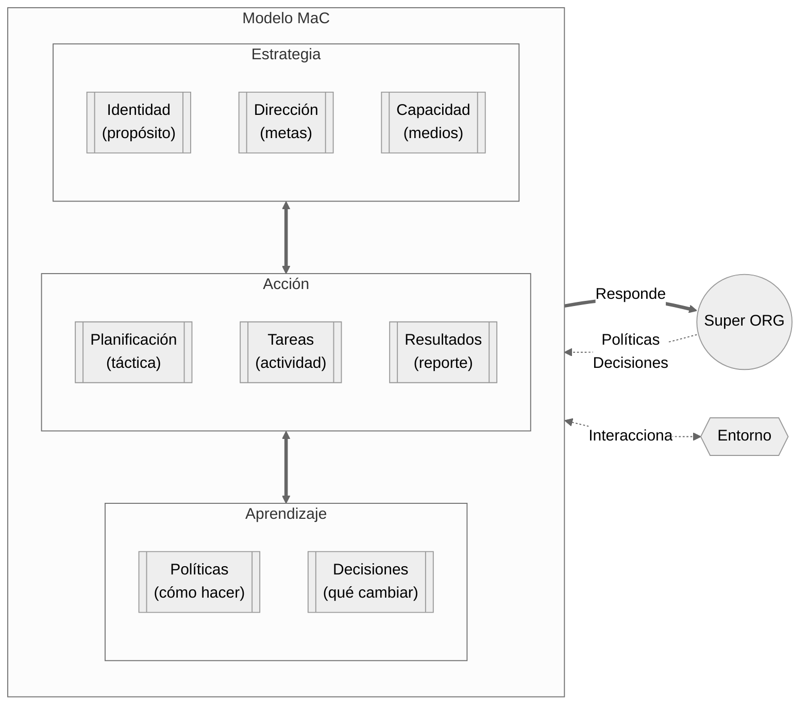

# Preguntas que responde MaC

MaC es un sistema de gestión basado en el ciclo **Acción → Aprendizaje** siguiendo una estrategia común. Este documento presenta las preguntas que cada capa necesita responder. No es necesario responderlas todas: elige las que sean relevantes para tu organización, tu escala y tu momento.

Al final hay una sección con preguntas que pueden automatizarse: son las que un agente IA puede responder a partir de los documentos existentes, cruzando capas y detectando patrones. Un humano puede hacer el mismo trabajo manualmente; el agente lo hace más rápido. Si ya tienes acceso a un agente con capacidad de leer tu vault, puedes empezar a delegarle estas preguntas hoy.

Ver [Método MaC](metodo-mac.md) para el modelo completo y [Implementación de MaC](implementacion-mac.md) para la guía práctica.

1. **Estrategia**
	- **Identidad**: _¿Por qué existimos y qué nos diferencia?_
	- **Dirección**: _¿Hacia dónde vamos y cómo sabremos que llegamos?_
	- **Capacidad**: _¿Con qué contamos realmente?_
2. **Acción**
	- **Planificación**: _¿Qué hacer a continuación?_
	- **Tareas**: _¿Qué hacer concretamente?_
	- **Resultados**: _¿Quién ejecutó y qué fue diferente a lo esperado?_
3. **Aprendizaje**
	- **Decisiones**: _¿Qué decidimos, cuándo y por qué?_
	- **Políticas**: _¿Qué debemos hacer diferente?_

---

## Pilar 1 — Estrategia

La estrategia es lo que permanece estable mientras el ciclo Acción → Aprendizaje gira. Define quiénes somos, hacia dónde vamos y con qué contamos. Solo cambia cuando el aprendizaje produce una decisión que la modifica explícitamente.

### Identidad

**Pregunta corta**: _¿Por qué existimos y qué nos diferencia?_

**Pregunta extendida**: _¿Qué nos constituye como organización y qué seguiría siendo verdadero aunque todo lo demás cambiara?_

- ¿Por qué existe esta organización?
- ¿Qué problema resuelve que nadie más resuelve de esta forma?
- ¿Para quién existe?
- ¿Qué principios no negociamos bajo ninguna circunstancia?
- ¿Cómo sabemos si nos estamos desviando de lo que somos?
- ¿Qué dejaría de existir si esta organización desapareciera?

### Dirección

**Pregunta corta**: _¿Hacia dónde vamos y cómo sabremos que llegamos?_

**Pregunta extendida**: _¿Qué hemos decidido que debe ser verdad al final de este horizonte, y cómo lo reconoceremos cuando ocurra?_

- ¿Qué queremos lograr y en qué horizonte de tiempo?
- ¿Cómo sabremos que lo logramos?
- ¿Quién es responsable de cada objetivo?
- ¿Qué objetivos son incompatibles entre sí y cómo lo resolvemos?
- ¿Qué objetivos del ciclo anterior no se cumplieron y por qué siguen o no en la lista?

**1 persona:**

- ¿Mis objetivos actuales son compatibles con mi capacidad real de tiempo?
- ¿Estoy persiguiendo esto porque es estratégico o porque es urgente?

**2-10 personas:**

- ¿Todos los miembros del equipo pueden enunciar los objetivos sin leer el documento?
- ¿Los objetivos individuales de cada persona conectan explícitamente con los objetivos organizacionales?

**Organización mediana:**

- ¿Hay objetivos que compiten por los mismos recursos sin que nadie lo haya resuelto explícitamente?
- ¿Los objetivos operacionales y los estratégicos están diferenciados o se confunden?
- ¿Quién tiene autoridad para modificar un objetivo en curso y bajo qué condiciones?

### Capacidad

**Pregunta corta**: _¿Con qué contamos realmente?_

**Pregunta extendida**: _¿Cuál es el inventario real de medios, dependencias y restricciones que definen lo que esta organización puede y no puede hacer?_

- ¿Qué recurso, si falla, detiene la operación?
- ¿De qué dependencias externas no tenemos control y cuál es su perfil de riesgo?
- ¿Qué capacidad de respaldo podríamos activar si la principal falla?
- ¿En qué períodos nuestra capacidad cae sistemáticamente?
- ¿Cuál es el costo real de nuestra capacidad actual?

**1 persona:**

- ¿Tengo un punto único de falla (una sola máquina, una sola cuenta, un solo contacto)?
- ¿Qué habilidades necesito que hoy no tengo y estoy supliendo con esfuerzo extra?

**2-10 personas:**

- ¿Qué conocimiento crítico está concentrado en un solo miembro del equipo?
- ¿Qué proveedores tienen variabilidad de plazo que afecta nuestra promesa al cliente?

**Organización mediana:**

- ¿Qué especialidades críticas están cubiertas por una sola persona?
- ¿En qué estado están los recursos críticos y cuándo es la próxima revisión programada?

---

## Pilar 2 — Acción

La acción es donde la estrategia se convierte en realidad. Se descompone en tres momentos: planificar qué viene, ejecutar las tareas, y registrar los resultados. Los resultados —especialmente las sorpresas— son el insumo del aprendizaje.

### Planificación

**Pregunta corta**: _¿Qué hacer a continuación?_

**Pregunta extendida**: _¿Dado lo que sabemos hoy sobre nuestra dirección, capacidad y aprendizajes recientes, qué es lo más importante que debemos hacer en el próximo ciclo, y qué lo podría impedir?_

- ¿Qué objetivos de Dirección necesitan avance este ciclo?
- ¿Cuántas horas reales tenemos disponibles este ciclo y cómo se reparten?
- ¿Qué aprendizajes o decisiones recientes cambian lo que habíamos planeado?
- ¿Qué compromisos externos tienen fecha en este ciclo?
- ¿Hay bloqueos del ciclo anterior que necesitan resolverse primero?
- ¿Hay restricciones del entorno que estamos ignorando en esta planificación?

**1 persona:**

- ¿Cuáles son mis 3 prioridades esta semana y por qué esas y no otras?
- ¿Cuántas horas puedo dedicar realmente a cada proyecto este ciclo sin colapsar?
- ¿Qué puedo delegar, postergar o eliminar para proteger lo esencial?

**2-10 personas:**

- ¿Cada miembro del equipo sabe qué se espera de él este ciclo?
- ¿Hay miembros del equipo sobrecargados mientras otros tienen capacidad ociosa?
- ¿Hay dependencias entre personas que no están explícitas?

**Organización mediana:**

- ¿La planificación de los equipos es mutuamente consistente?
- ¿Los objetivos más exigentes están asignados a los períodos de mayor capacidad?
- ¿Hay interdependencias entre áreas que nadie está coordinando?

### Tareas

**Pregunta corta**: _¿Qué hacer concretamente?_

**Pregunta extendida**: _¿Qué actividades específicas están asignadas, a quién, con qué plazo, y cuál es su estado actual?_

- ¿Quién está haciendo qué, con qué fecha de compromiso?
- ¿Qué está bloqueado y por qué?
- ¿Qué debería haberse completado y no se completó?
- ¿Hay tareas que están consumiendo tiempo sin conectar con ningún objetivo?
- ¿Qué compromisos asumimos hacia afuera y cuál es su estado?

**1 persona:**

- ¿Qué hipótesis estoy probando esta semana?
- ¿Estoy avanzando en lo importante o apagando incendios?

**2-10 personas:**

- ¿Cuál es el estado de cada pedido o entrega activa?
- ¿Qué clientes o stakeholders están en riesgo de insatisfacción?
- ¿Qué oportunidades activas tienen fecha de vencimiento?

**Organización mediana:**

- ¿Qué órdenes de trabajo están activas, en qué estado y con qué prioridad?
- ¿Hay alguna condición de seguridad o cumplimiento no resuelta?
- ¿Qué compromisos programados están en riesgo de no ejecutarse a tiempo?

### Resultados

**Pregunta corta**: _¿Quién ejecutó y qué fue diferente a lo esperado?_

**Pregunta extendida**: _¿Qué ocurrió realmente versus lo que habíamos planificado, y dónde están las sorpresas que merecen atención?_

Los resultados son el puente entre la acción y el aprendizaje. Lo que importa no es solo registrar qué se hizo, sino capturar las diferencias entre lo esperado y lo real: ahí están las sorpresas de las que se aprende.

- ¿Qué se completó este ciclo y qué quedó pendiente?
- ¿Qué salió diferente a lo planificado y por qué?
- ¿Qué fue más fácil o más difícil de lo esperado?
- ¿Hubo resultados inesperados —positivos o negativos— que no estaban contemplados?
- ¿Qué compromisos hacia afuera se cumplieron y cuáles no?
- ¿La capacidad usada correspondió a lo estimado?

**1 persona:**

- ¿Qué aprendí esta semana que cambia lo que haré la próxima?
- ¿En qué gasté tiempo que no generó valor?

**2-10 personas:**

- ¿Qué entregas generaron feedback del cliente y cuál fue?
- ¿Hubo retrasos causados por dependencias internas que no estaban explícitas?

**Organización mediana:**

- ¿Qué métricas operativas se desviaron del rango esperado?
- ¿Hay patrones de incumplimiento que se repiten entre ciclos?

---

## Pilar 3 — Aprendizaje

El aprendizaje cierra el ciclo. Toma los resultados (especialmente las sorpresas), los convierte en comprensión, y produce dos tipos de output: **decisiones** (qué cambiar puntualmente) y **políticas** (cómo hacer las cosas de manera general). El aprendizaje es lo que conecta la experiencia con la mejora.

### Decisiones

**Pregunta corta**: _¿Qué decidimos, cuándo y por qué?_

**Pregunta extendida**: _¿Qué razonamiento produjo cada decisión significativa, qué alternativas descartó, y bajo qué condición debería revisarse?_

Las decisiones son el output puntual del aprendizaje. Se registran en el momento de decidir y se consultan en el momento de dudar.

**Al registrar una decisión:**

- ¿Qué se decidió exactamente?
- ¿Quién decidió y con qué autoridad?
- ¿Qué alternativas se descartaron?
- ¿Con qué información se tomó la decisión?
- ¿Qué condición haría razonable revisar esta decisión?

**Al consultar el log:**

- ¿Ya decidimos algo sobre esto antes?
- ¿Las condiciones que justificaron esa decisión siguen vigentes?
- ¿Hay decisiones tomadas hace más de X meses que nadie ha revisado?
- ¿Hay patrones en el tipo de decisiones que tomamos o evitamos tomar?

**1 persona:**

- ¿Estoy repitiendo decisiones que ya tomé porque no las registré?

**2-10 personas:**

- ¿Hay decisiones que afectan a todo el equipo pero fueron tomadas por una sola persona sin comunicarlo?
- ¿Cuántas decisiones del último ciclo fueron consultadas con el equipo antes de ejecutarse?

**Organización mediana:**

- ¿Hay decisiones que se están tomando a niveles distintos de forma inconsistente porque no hay log compartido?
- ¿Hay decisiones delegadas que no tienen criterio de escalamiento definido?
- ¿Quién tiene autoridad para revertir una decisión y bajo qué condiciones?

### Políticas

**Pregunta corta**: _¿Qué debemos hacer diferente?_

**Pregunta extendida**: _¿Qué reglas, criterios o formas de trabajar hemos adoptado como resultado de lo que aprendimos, y siguen siendo válidas?_

Las políticas son el output estructural del aprendizaje. Mientras las decisiones responden a situaciones puntuales, las políticas codifican patrones: cómo hacemos las cosas aquí.

- ¿Qué formas de trabajar hemos adoptado explícitamente como estándar?
- ¿Cada política vigente tiene un origen trazable (una decisión o un aprendizaje documentado)?
- ¿Hay formas de trabajar que seguimos por inercia sin que nadie las haya validado?
- ¿Las políticas actuales son coherentes entre sí o hay contradicciones?
- ¿Cuándo fue la última vez que revisamos si nuestras políticas siguen siendo útiles?
- ¿Hay situaciones recurrentes donde la gente no sabe qué hacer porque no existe una política?

**1 persona:**

- ¿Tengo criterios claros para las decisiones que tomo frecuentemente, o las resuelvo cada vez desde cero?
- ¿Mis reglas personales de trabajo están documentadas o solo en mi cabeza?

**2-10 personas:**

- ¿El equipo tiene claridad sobre cómo se hacen las cosas aquí, o cada uno opera con sus propias reglas?
- ¿Hay un onboarding documentado que transmita las políticas a nuevos miembros?

**Organización mediana:**

- ¿Las políticas están accesibles para todos o viven en la cabeza de los fundadores?
- ¿Hay políticas que se aplican de forma inconsistente entre áreas?
- ¿Quién tiene autoridad para crear o modificar una política?

---

## Agentes: Preguntas automatizables

Estas preguntas cruzan capas y buscan inconsistencias, vacíos y patrones. Un humano puede responderlas revisando sus documentos; un agente IA puede hacerlo más rápido procesando la documentación existente (logs, planes, identidad, tareas, decisiones, políticas) para preparar las sesiones humanas.

> Si ya practicas MaC y tienes acceso a un agente IA con capacidad de leer archivos, estas preguntas son las primeras que puedes delegarle. No necesitas automatización completa: basta con pedirle al agente que revise tu vault y responda estas preguntas antes de cada ritual.

### Estrategia

**Identidad:**
- ¿Existe una declaración de propósito explícita en los documentos, o solo se infiere?
- ¿Las decisiones registradas son coherentes con los principios declarados?
- ¿El lenguaje usado en los documentos operativos refleja la identidad declarada?

**Dirección:**
- ¿Qué objetivos declarados no tienen ninguna tarea asociada?
- ¿Qué objetivos llevan más de un ciclo sin cambio de estado ni mención en resultados?
- ¿Hay objetivos cuyo responsable no aparece como agente en ninguna tarea activa?
- ¿Hay objetivos del ciclo anterior que desaparecieron sin decisión registrada que lo justifique?

**Capacidad:**
- ¿Qué tareas activas dependen del mismo recurso o persona, creando un cuello de botella implícito?
- ¿Los objetivos más exigentes del ciclo están asignados a períodos donde históricamente la capacidad baja?
- ¿Hay dependencias externas que aparecen en más de un objetivo sin plan B documentado?
- ¿La suma de compromisos activos excede la capacidad declarada para el período?

### Acción

**Planificación:**
- ¿La planificación del ciclo actual referencia los aprendizajes del ciclo anterior?
- ¿Hay tareas planificadas que no conectan con ningún objetivo de Dirección?
- ¿Se repite la misma planificación de ciclo en ciclo sin ajustes?

**Tareas:**
- ¿Qué tareas llevan más de un ciclo sin cambio de estado?
- ¿Hay bloqueos registrados que no generaron ninguna decisión?
- ¿Qué compromisos hacia afuera vencen en el próximo ciclo y tienen estado incompleto?

**Resultados:**
- ¿Qué resultados del último ciclo registran sorpresas explícitas?
- ¿Hay ciclos que terminaron sin un registro de resultados?
- ¿Qué porcentaje de lo planificado se completó versus lo que quedó pendiente?
- ¿Los resultados mencionan feedback externo o solo actividad interna?

### Aprendizaje

**Decisiones:**
- ¿Hay decisiones cuya condición de revisión ya se cumplió pero no han sido revisadas?
- ¿Se repiten decisiones sobre el mismo tema sin que se referencien entre sí?
- ¿Hay tareas activas que no tienen una decisión que las respalde?
- ¿Qué decisiones del último ciclo no registran alternativas descartadas ni información base?

**Políticas:**
- ¿Hay políticas que no se mencionan en ningún documento operativo?
- ¿Hay decisiones recurrentes sobre el mismo tema que podrían consolidarse en una política?
- ¿Alguna política contradice una decisión posterior sin que la política se haya actualizado?
- ¿Hay áreas de la operación donde no existe ninguna política documentada pero sí hay decisiones ad-hoc repetidas?

---

- → **[Método MaC](metodo-mac.md)** — El modelo completo, procesos, cadencias y preguntas avanzadas por relación.
- → **[Implementación de MaC](implementacion-mac.md)** — Cómo empezar según tu escala.
- → **[Procesos entre capas](procesos-mac.md)** — Detalle de cada proceso con ejemplos por escala.